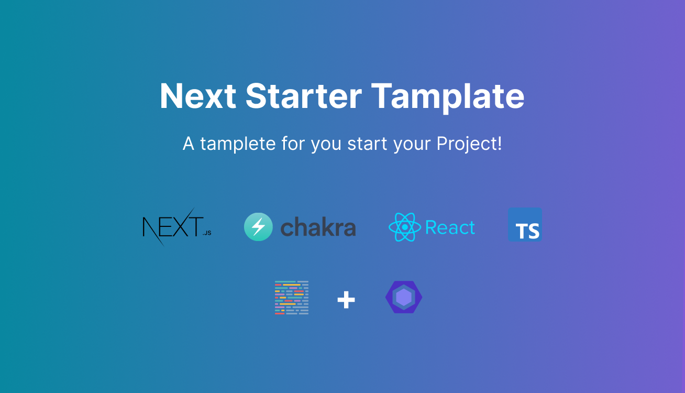

# Starter for Next JS 12+, Chakra UI 2+ and TypeScript

<div >
   <a href="#">
          
   </a 
   <a href="#">
       
  </a>
  <a href="#">
          
   </a 
   <a href="#">
          
   </a 
    <a href="#">
      
   </a>
   <a href="https://www.linkedin.com/in/marcos-antonio-579370160/" target="_blank">
      
    </a>
</div>
<br>
<div align="center">
  
</div>
<br>

🚀 Simple starter for Next JS 12+, Chakra UI 2+ and TypeScript, alias is already configured too!

Clone this project and use it to quickly create your own [Next.js](https://nextjs.org) project.


### Features

- ⚡ [Next.js](https://nextjs.org) for Yor awesome prject SSR / SSG
- 🔥 Types with [TypeScript](https://www.typescriptlang.org)
- 💎 Integrate with [Chakra UI](https://chakra-ui.com/)
- 📏 Linter with [ESLint](https://eslint.org) (STANDARD configuration)
- 🌈 Code Formatter with [Prettier](https://prettier.io)
- 🗂 Absolute Imports using `@` prefix


### Requirements

- Node.js 14+ and npm

### Files Estructure 

```shell
.
├── public                          # Public assets folder 
├── src
│   ├── Components                  # Components folder
│   ├── pages                       # Next JS Pages
│   ├── styles                      # Styles folder 
├── .editorConfig                   # editorConfig configuration
├── .eslintrc.json                  # eslintrc configuration
├── .prettierrc                     # prettierrc configuration
└── tsconfig.json                   # TypeScript configuration
├── README.md                       # README file 
```

### Contributions

Everyone is welcome to contribute to this project. Feel free to open an issue if you have any improvements to suggest.

### License

Licensed under the MIT License, Copyright © 2022

See [LICENSE](LICENSE) for more information.

---
